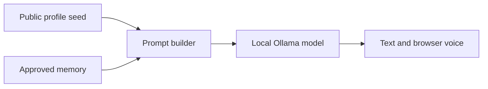

# Chris Avatar MVP

> I am a PhD student at the University of Florida researching digital twin technology and artificial intelligence for healthcare and bioinformatics.


This subproject turns the existing LLM digital twin research repository into a usable, local first personal AI avatar.

The first release is deliberately conservative. It can talk through a local open weight model, retrieve approved memories, preserve conversation history, accept candidate memories for review, and speak responses through the browser. It cannot send messages, spend money, publish content, delete files, or impersonate Chris.

## Current architecture



The language model is replaceable. Identity and memory remain outside the model so the project is not locked to GPT, Claude, or any other provider.

## Included in this MVP

- Local model adapter for Ollama
- Default Qwen configuration, replaceable through an environment variable
- FastAPI service and browser interface
- Text chat, browser microphone input, and browser speech output
- Versionable public profile documents
- SQLite conversation history
- Candidate, approved, and rejected memory states
- Deterministic keyword retrieval over approved memories
- Tests for memory governance and prompt construction
- No autonomous external tools

## Run locally on Windows

Install Python 3.11 or newer and Ollama. In PowerShell, from this `avatar` directory:

```powershell
ollama pull qwen3:8b
ollama serve

python -m venv .venv
.\.venv\Scripts\Activate.ps1
pip install -r requirements.txt
Copy-Item .env.example .env
uvicorn app.main:app --reload --host 127.0.0.1 --port 8787
```

Open `http://127.0.0.1:8787`.

If your machine cannot comfortably run the default model, set `AVATAR_MODEL` in `.env` to a smaller Ollama model. A larger model can be selected without changing the avatar's stored identity or memory.

## Private personalization

This GitHub repository is public. The checked in `profile` directory therefore contains only a high level starter profile.

For actual chat exports, private writing, unpublished research, company material, or personal history:

1. Create a directory outside the repository.
2. Copy the four profile Markdown files into it.
3. Point `AVATAR_PROFILE_DIR` to that directory.
4. Never commit that directory, API keys, patient information, or private conversation exports.

The most valuable future training data will be Chris's own final writing, decisions with reasons, and corrections. Assistant responses should be labeled separately so the avatar does not learn another model's language as Chris's beliefs.

## Memory governance

New memories enter as `pending`. Chris must approve them before retrieval can place them in the model context. Rejected memories remain auditable but are never retrieved.

This is intentional. A language model saying "remember this" is not sufficient authorization to rewrite a person's identity.

## API

| Endpoint | Purpose |
| --- | --- |
| `GET /api/health` | Check service and local model status |
| `POST /api/chat` | Chat using the profile, history, and relevant approved memories |
| `GET /api/memories` | List memory records by status |
| `POST /api/memories` | Create a pending memory |
| `POST /api/memories/{id}/approve` | Promote a reviewed memory |
| `POST /api/memories/{id}/reject` | Reject a candidate memory |

## Next milestones

1. Import only Chris-authored messages from selected conversation exports.
2. Add source citations and provenance to every retrieved memory.
3. Build a held-out evaluation set measuring factual recall, style similarity, decision agreement, and calibrated uncertainty.
4. Add semantic retrieval only after the deterministic baseline is measured.
5. Add optional tools in read-only mode, followed by explicit approval gates for every external action.
6. Add a rendered face or video avatar after the cognitive proxy is reliable.
